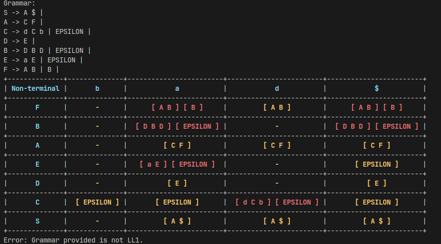
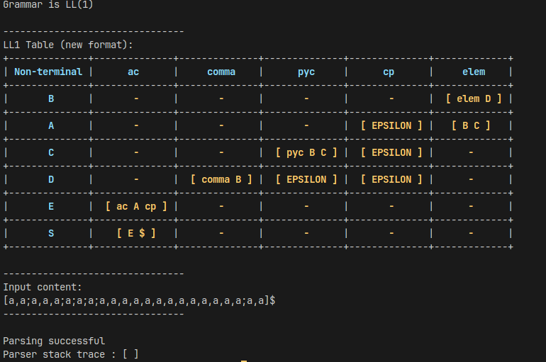
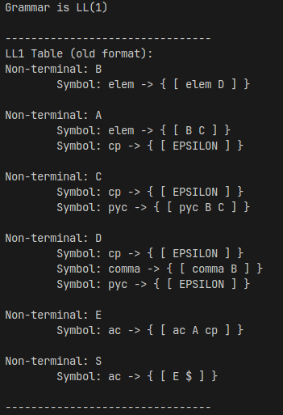

# LL1Checker
**LL1Checker** is a tool for verifying if a grammar is LL(1) and for validating whether an input string belongs to the language generated by the grammar. The grammar is read from a file.

## 📖 Table of Contents
1. [Project Status](#-project-status)
2. [Run the Program](#%EF%B8%8F-run)
3. [Considerations](#-considerations)
4. [Structure of grammar.txt](#-structure-of-grammartxt)
5. [Want to Contribute?](#-want-to-contribute)
6. [Compilation](#%EF%B8%8F-compilation)
7. [Documentation](#-documentation)

## 🚀 Project Status

This project is complete, with all essential functionalities implemented and tested with various grammars. It is now in maintenance mode for potential enhancements or bug fixes.  
If you encounter any issues or unexpected interpretations, please open an issue and include relevant details. Contributions for further improvement are welcome!

## ▶️ Run

You can run the program as follows:
~~~
./ll1 <GRAMMAR_FILENAME> [TEXT_FILENAME] [OPTIONS]
~~~ 
### Positional Arguments:
- `<GRAMMAR_FILENAME>`: Path to the file containing the grammar.
- `[TEXT_FILENAME]` (optional): If provided, the program will validate whether the input string belongs to the language defined by the grammar.

### Options:
- `-h, --help`: Show help message.
- `-v, --verbose`: Enable verbose mode, displaying the LL(1) table and input content.
- `--format <FORMAT>`: Specify the table format (`old` or `new`).  
  - If set, `verbose` mode is enabled automatically.  
  - The default format is `"new"`.

### Examples:

#### Checking if a grammar is LL(1)
~~~
./ll1 grammar.txt
~~~
- Verifies if the provided grammar is LL(1).  

### No LL1 grammars
If the grammar provided is not LL1, an error will be displayed alongside its table:

#### Checking if an input string belongs to the grammar
~~~
./ll1 grammar.txt input.txt
~~~
- Verifies if the grammar is LL(1).  
- Parses the `input.txt` file according to the grammar.

#### Enabling verbose mode
~~~
./ll1 grammar.txt input.txt -v
~~~

- Displays the entire LL(1) table.  
- Prints the contents of `input.txt` before parsing.

#### Specifying the table format
~~~
./ll1 grammar.txt -v --format old
~~~

- Use the old table format when the new format cannot be displayed correctly due to screen size

**Error Handling**:  
If `<GRAMMAR_FILENAME>` or `<TEXT_FILENAME>` do not exist or cannot be opened, the program will print an error and exit.

## 📌 Considerations
- The end-of-line character can be omitted in the grammar (see grammar.txt), but it's recommended to add a first rule, such as `S -> E EOL`, where `S` is the axiom.
- For terminal symbols, note that order matters. If two regexes have common elements, place the more specific one first, as in the example:
~~~
terminal WH "while";
terminal WORD [a-zA-Z][a-zA-Z]*;
~~~

## 📄 Structure of grammar.txt

The grammar file has two sections separated by `;`: **symbol definition** and **grammar definition**.

### Symbol definition
~~~
start with S;
~~~
You should write the last line to designate S as the axiom.
The terminal symbols follow the following structure: `terminal <IDENTIFIER> <REGEX>;` (like a variable!). The `<IDENTIFIER>` should adhere to the following regex pattern: `[a-zA-Z_\'][a-zA-Z_\'0-9]*`.
An example of the first section would be:
~~~
terminal a a;
start with S;
;
~~~
### Grammar definition
The grammar follows the following structure:
~~~
S -> A$;
A -> aaA;
A ->;
;
~~~
The line `A->;` represents an empty production.
So, our **grammar.txt** would be:
~~~
terminal a a;
start with S;
;
S -> A$;
A -> aaA;
A ->;
;
~~~
This grammar generates the following language: `L(G) = {aa, aaaa, aaaaaa, ...}`, that is, a language with an even number of 'a'.
And in **input.txt** file, you place the line you want to check.

## 🤝 Want to Contribute?

To get started, you'll need the following:
- Boost Libraries: Make sure you have the following installed:
  - `boost_regex`
  - `boost_program_options`

Feel free to reach out if you have any questions or suggestions! 😊

### 🛠️ Compilation
A Makefile is provided, so, run `make` to compile the project.

## 📚 Documentation

The complete API documentation is available here:  
[**LL1Checker Documentation**](https://jose-rzm.github.io/LL1Checker/)
