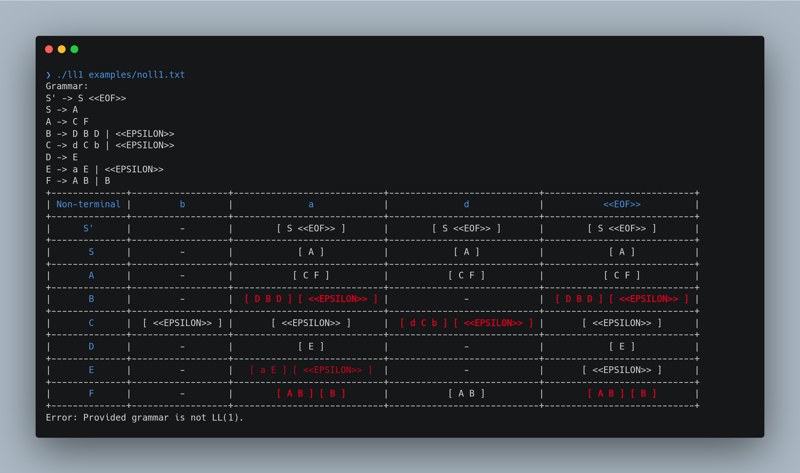
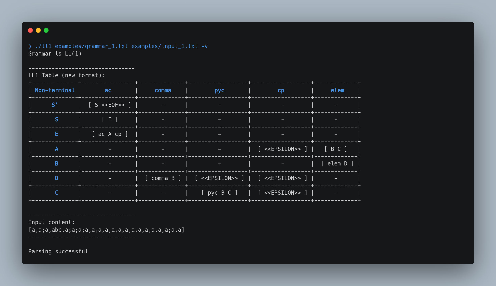
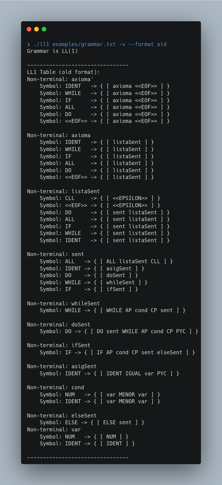

# LL1Checker
**LL1Checker** is a tool for verifying if a grammar is LL(1) and for validating whether an input string belongs to the language generated by the grammar. The grammar is read from a file.

## 📖 Table of Contents
1. [Project Status](#-project-status)
2. [What's New in v5.0](#-whats-new-in-v50)
3. [Run the Program](#%EF%B8%8F-run)
4. [Dependencies](#-dependencies)
5. [Considerations](#-considerations)
6. [Structure of grammar.txt](#-structure-of-grammartxt)
7. [Want to Contribute?](#-want-to-contribute)
8. [Compilation](#%EF%B8%8F-compilation)
9. [Documentation](#-documentation)

## 🚀 Project Status

This project is complete, with all essential functionalities implemented and tested with various grammars. It is now in maintenance mode for potential enhancements or bug fixes.  
If you encounter any issues or unexpected interpretations, please open an issue and include relevant details. Contributions for further improvement are welcome!

## 🆕 What's New in v5.0

- The lexer, parser, and symbol table now work with numeric token identifiers, improving table lookups and reducing memory usage for large grammars.
- Boost.Spirit powers the dynamic lexer and the parser now mirrors its diagnostics, so both lexing and parsing errors display multi-line windows with a caret pointing at the failing token.
- Parse sessions can export a full parse tree to GraphViz-compatible `.dot` files via `--export-tree`, making it easy to visualize derivations.
- Grammar validation is stricter: duplicate terminal or non-terminal identifiers abort loading with a descriptive error, and parse tree exports now fail fast if the output file cannot be created.
- Command-line handling exits immediately on invalid options, preventing partial runs when arguments are malformed.
- The build system gained an opt-in static linking toggle (`LL1CHECKER_FORCE_STATIC_RUNTIME`) and a `make static` helper target; CMake will also fetch `cxxopts` automatically when it is not installed.

## ▶️ Run

You can run the program as follows:
~~~
./ll1 <GRAMMAR_FILENAME> [TEXT_FILENAME] [OPTIONS]
~~~ 
### Positional Arguments:
- `<GRAMMAR_FILENAME>`: Path to the file containing the grammar.
- `[TEXT_FILENAME]` (optional): If provided, the program will validate whether the input string belongs to the language defined by the grammar.

### Options:
- `-h, --help`: Show help message.
- `-v, --verbose`: Enable verbose mode, displaying the LL(1) table and input content.
- `--format <FORMAT>`: Specify the table format (`old` or `new`).
  - If set, `verbose` mode is enabled automatically.
  - The default format is `"new"`.
- `--text <STRING>`: Directly parse the provided text instead of reading a file.
- `--export-tree <FILE>`: Write the parse tree to a GraphViz `.dot` file when parsing succeeds.

### Examples:

#### Checking if a grammar is LL(1)
~~~
./ll1 grammar.txt
~~~
- Verifies if the provided grammar is LL(1).  

#### No LL1 grammars
If the grammar provided is not LL1, an error will be displayed alongside its table:


#### Checking if an input string belongs to the grammar
~~~
./ll1 grammar.txt input.txt
~~~
- Verifies if the grammar is LL(1).
- Parses the `input.txt` file according to the grammar.

#### Parsing text from the command line
~~~
./ll1 grammar.txt --text "aa"
~~~
- Parses `"aa"` according to the grammar without creating a file.

#### Enabling verbose mode
~~~
./ll1 grammar.txt input.txt -v
~~~

- Displays the entire LL(1) table.  
- Prints the contents of `input.txt` before parsing.

#### Specifying the table format
~~~
./ll1 grammar.txt -v --format old
~~~


- Use the old table format when the new format cannot be displayed correctly due to screen size

**Error Handling**:  
If `<GRAMMAR_FILENAME>` or `<TEXT_FILENAME>` do not exist or cannot be opened, the program will print an error and exit.

## 📦 Dependencies
- C++20 capable compiler and CMake ≥ 3.16.
- Boost headers (tested with Boost 1.78+); required for the lexer built on Boost.Spirit.
- [`cxxopts`](https://github.com/jarro2783/cxxopts) for command-line parsing. CMake will reuse an existing installation or automatically fetch v3.1.1 during configuration.

## 📌 Considerations
- The end-of-line character can be omitted in the grammar (see grammar.txt), but it's recommended to add a first rule, such as `S -> E EOL`, where `S` is the axiom.
- For terminal symbols, note that order matters. If two regexes have common elements, place the more specific one first, as in the example:
~~~
terminal WH "while";
terminal WORD [a-zA-Z][a-zA-Z]*;
~~~

## 📄 Structure of grammar.txt

The grammar file has two sections separated by `;`: **symbol definition** and **grammar definition**.

### Symbol definition
~~~
start with S;
~~~
You should write the last line to designate S as the axiom.
The terminal symbols follow the following structure: `terminal <IDENTIFIER> <REGEX>;` (like a variable!). The `<IDENTIFIER>` should adhere to the following regex pattern: `[a-zA-Z_\'][a-zA-Z_\'0-9]*`.
An example of the first section would be:
~~~
terminal a a;
start with S;
;
~~~
### Grammar definition
The grammar follows the following structure:
~~~
S -> A$;
A -> aaA;
A ->;
;
~~~
The line `A->;` represents an empty production.
So, our **grammar.txt** would be:
~~~
terminal a a;
start with S;
;
S -> A$;
A -> aaA;
A ->;
;
~~~
This grammar generates the following language: `L(G) = {aa, aaaa, aaaaaa, ...}`, that is, a language with an even number of 'a'.
And in **input.txt** file, you place the line you want to check.

## 🗂️ Project Structure
The repository follows a simple layout keeping sources and headers separated:
```
LL1Checker/
├── CMakeLists.txt
├── Makefile         # Helper Makefile to speed up compilation or formatting
├── src/             # Source files and CMake logic
├── include/         # Header files
├── app/             # Main file
├── examples/        # Example grammars and inputs
└── docs/            # Generated documentation
```

## 🤝 Want to Contribute?

To get started, you'll need the following:
- A working C++20 toolchain plus the dependencies listed above.
- Familiarity with CMake; configuration will fetch `cxxopts` automatically if it is not already available on your system.

Feel free to reach out if you have any questions or suggestions! 😊

### 🛠️ Compilation
To build the project using CMake:
```bash
cmake -S . -B build
cmake --build build
```
Alternatively, you can simply run:
```bash
make
```
This will configure and compile the project using the default `Debug` build type. To compile in Release mode:
```bash
make BUILD_TYPE=Release
```
To produce a static Release build (when your toolchain supports it):
```bash
make static
# or make BUILD_TYPE=Release STATIC=1 build
```
This passes `-DLL1CHECKER_FORCE_STATIC_RUNTIME=ON` to CMake and links the C++ runtime statically where available.

The `ll1` executable will be located at `build/app/ll1`.

## 📚 Documentation

The complete API documentation is available here:  
[**LL1Checker Documentation**](https://jose-rzm.github.io/LL1Checker/)
